total time spent: 97 hours

## 15th of May

highway was just announced :D

Anyways I was coming up with a few project ideas when suddenly I thought: GUN\
But a gun is boring tbh. It just shoots and does weird stuff.\
So what could be better than a gun you may ask?\
A gun.... ON WHEELS.\
But what could be better than a gun on wheels?\
A REMOTE CONTROL GUN ON WHEELS.

You heard it here first folks. thats how we roll.

Anyways now its time for my suoer cool progress report\
*insert super cool name for the project report*\
I did some cadding today for like an hour or 2 and I made a wheel :D\
I also made some gears and mechanical stuff for the back tires.\
thats about it tbh.\
\

Anyways time for a farewell my good friends, \
Until the next we meet.

Time spent: about an hour

## 16th of May

hello. I am writing this on the 17th cuz i forgot to do it yesterday.\
anyways I dibbled a bit in the cad but mainly started up with my pcb and electronics.

so I started doing pcb stuff. but I came across a problem.\
I dont want to buy and use a motor driver. but I need the dc motor to be able to move forwards and backwards.\
after a bit of thinking, i remembered an old school project where i did that but with a physical switch.\
now the question was, how do i make that into something i can turn on with gpio pins?

after a bunch of thinking and designs later, I reinvented the H bridge.\

after that i started work on the schematic and pcb and ended off the day looking like this:\
\

oh yeah i decided to use an esp32 as the mcu so i could use esp-now as the communication between it and the controller.

Time spend: 1-2 hours(I forgot but somewhere in that range)

## 17th of May

okay time for todays update. im gonna talk as if you have image references and then add the images in later cuz im not bothered rn tbh.\
if you can see images here then congrats, you came after i added images.

Okay so with my schematic i added a whole bunch of stuff like the stepper motor, more h-bridges, more servos, battery connectors, etc.\
also that weird stuff going on with my battery connectors is me trying to make both a 6V and 12V power supply come from 2 6V batteries.\
so the diodes limit the flow so it doesnt blow up on itself and the batteries are aranged so they are both in series and in parallel at the same time.

I also added more h-bridges and servo spots than im actually gonna use\
the thought process is that if in the future i wanted to change up the functionality, then i could use those extra ones if needed. plus I had space anyways.

\

tmrw im gonna probably gonna go and start on the internals cadding. but i need to do meth and physics hw first :(\
anyways bye

Time spent today: 5 hours

## 18th of May
### 1am
so i was looking into the esp input voltage and turn out it can handle a 12V input.\
but that diode mess was not for nothing. I still need it for my motors.\

UPDATE: im just gonna use a buck converter. I dont wanna gamble on my idea just to save $2

found a nice battery so gonna save the link here: https://www.amazon.com.au/cart/smart-wagon?newItems=af51fb0b-661d-4de9-b8e5-c46f956c932f,1&ref_=sw_refresh

Hours spent: 1

## 21st of May
I'm finally back

anyways I am in pain\
onshape sucks\
and linux literally doesnt have any better options.\
so until i get a new laptop, its gonna be incredibly slow production.

anyways what i did today:\
lots of cadding and stuff.\
made some ideas for suspensions\
got a lesson from my dad on how suspensions are stupidly harder to use\
settled on just hard connections\
now designing that stuff\
learnt how horrid onshape is for doing anything big of with lots of parts.

hours spent: 3

## 23rd of May

okay so i got sick yesterday and wasnt able to make an entry so im gonna summarise both days work today. 

So first some yap. In approximately 11 hours and 35 minutes, the kickoff call will start. thats fun and exciting.

Okay so onwards to what I did.\
Yesterday I worked a lot on my back half of the car and did quite a lot of work and got most of the interals done for the back half of the car. And today I finished up those internals and got them at an acceptable standard for me.

\

I also got started on the gun mechanism and roughly mapped out 2 of the axis for my gun to move around with.

\

# THE PROBLEM

So due to australian gun laws, it is illegal to possess, make, or hold schematics of any weapon. Toy or not.\
Due to this, my entire plan of making a gun on top of an rc car is shut down.\
So what can i do to solve this?\
Its an rc car with a 4 axis robotic arm on top.\
Instead of a ranged weapon, its a close combat fighter. /j

anyways thats my idea now so I need to go back and make changes to my pcb and bom. I need to add another stepper motor to my pcb(this is gonna take a big battery)\
My plan for the arm is to have 3 bending points and one spinning point. the bottom bending point uses a stepper motor for extra strength and the top 2 and hand will use servos the hand might use a 5v motor though. (havent decided yet)

hours spent: 5

## 24th of May
so today was the call for highway and it was peak.

today i started part research and a pcb overhaul to accomodate for the extra motors needed in the arm. now the problems with this: I found out that the transistors i am using can only handle up to 100 mA when i need about 1A to drive the motor. so thats a big problem. Next problem: Im using 12V motors and most mosfets i looked at cant properly fuction with 12V and a 3.3V trigger and the ones that do are all smd parts which are impossible for me to work with.

so my plan rn is to just leave this until i find a solution and start working on something else.

time spent: 3 hours

## 4th of June

Im starting to work on this again and its pretty cool. I started on the arm since I am on a brain block on how to make the body.\
I made the hand part of the arm today.

For the hand, I used a worm gear(i think thats the name) with 4 prongs.

It started with a spur gear with a massive centre bore, Then I made 2 cuts from the centre out and got left with ~200-230 degrees of gear.\
I made a sketch for the prong to attach to the end of the gear and extruded it out both sides to make a prong. I then put a zigzag on the end of the prong and added a chamfer.

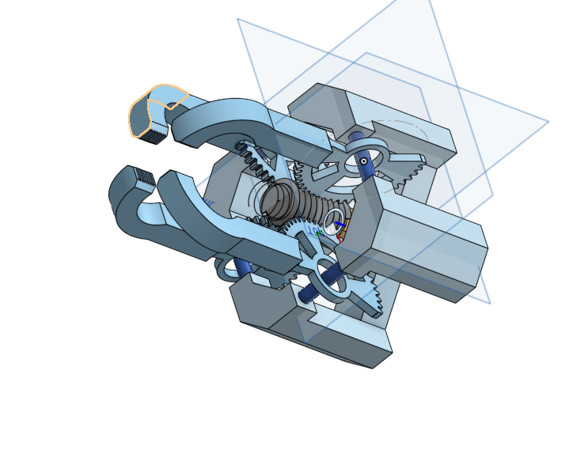

I then spent an hour trying to learn how to make screws and made a centre screw for the hand.\
I then copied it 3 times around the screw to make it look like the picture above.

Next was the frame. This was the hardish part.\
I started by editing the prongs to add a centre hole for a bearing and put a rod through it\
Then I made corner frame parts by alligning the 4 prongs\
I also made some chamfers to make it look nice

Next was the motor holder, I extruded 4 corners and platformed around a rectangle that I made as a motor placeholder.\

Next i put a square to hold the 4 parts together with screws.

And that was my day.

Time Spent: 2 hours

## 5th of June

Today was highway call. today was cool because I finaly figured out a good way to make a turning system that I can implement into this.

I will add some more info later on it once I start thinking about it a bit more

Yeah i have no clue on how to do this.\
I wanna die\
why is this so difficult to figure out\
ooh wait\
new idea\
lemme make some sketches

Time spent: 30 mins

## 18th of June

okay I am gonna do a full redesign. Now it will use 4 motors(1 per wheel) so then turning will be a lot easier to figure out.

## 6th of June

New idea maybe works\
not known for sure\
but there is a chance

## 1st July

Damn i havent worked on this in a while.

Okay so Im just going to full send on the 4 motor idea since i cant figure out a way to reliably steer. I also redownloaded macos so i got shapr3d back and am gonna port everything over to there.

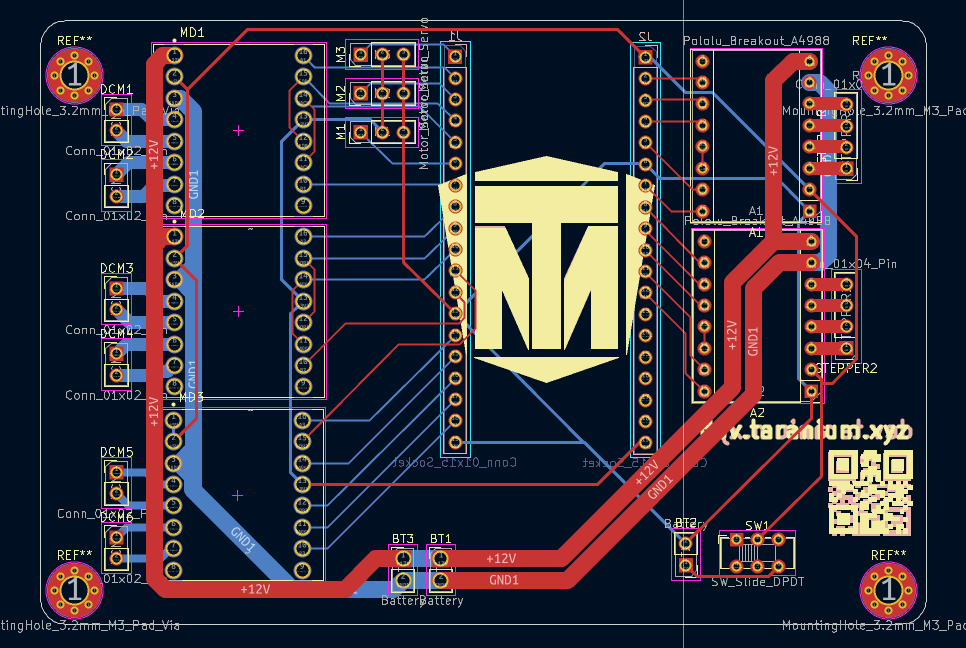

So today I redesigned the whole PCB(again) so now it can support all the motors I need and still have upgradeability and whatnot. I spent a while on this trying to make it have minimal vias(we dont like vias) and getting everything to line up well. th motor driver is a TB6612. its really nice and cool.

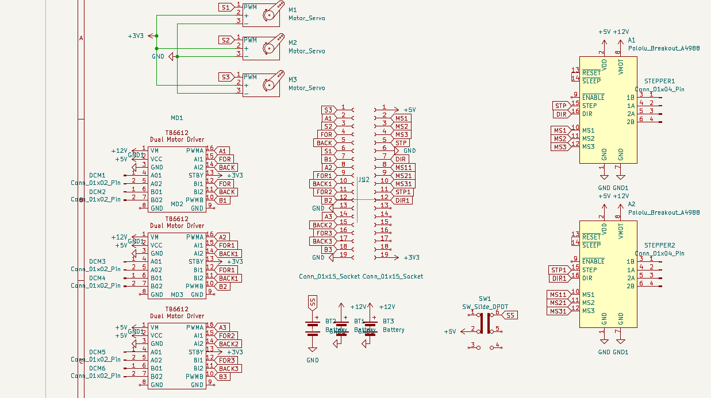

Oh and I made that symbol for the TB6612 btw. i wanted to make the footprint but i couldnt find any proper dimentions for it so i just pulled one off the internet

its crazy what this pcb used to be. but sadly i dont think anything else is possible.

time spent: 8 hours

## 2nd July

Time to start doing work on the model :D

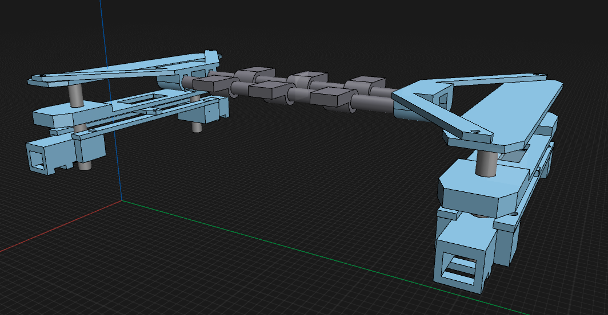

I fixed the motor mounts to actually rotate around a centre axle unlike before. and now it also has the screw holes and heatset holes fixed from 3mm and 5mm to 3.3 and 4.7 cuz i had it wrong  before.

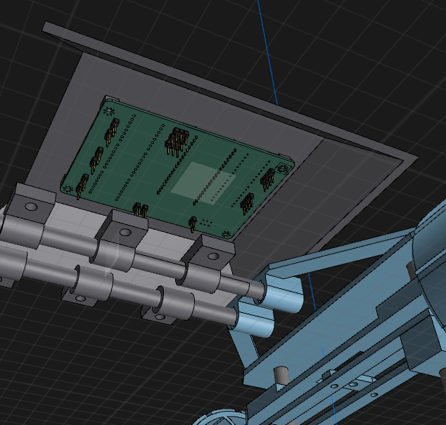

I also started on the chasis since internals needed it in order to progress.

i start with a top shell and position it roughly how high I want the chasis to be from the Internals. I also noticed it was a pretty big surface so im gonna use that area and mount the pcb there because yes.

Total Time: 3 hours

## 6th July

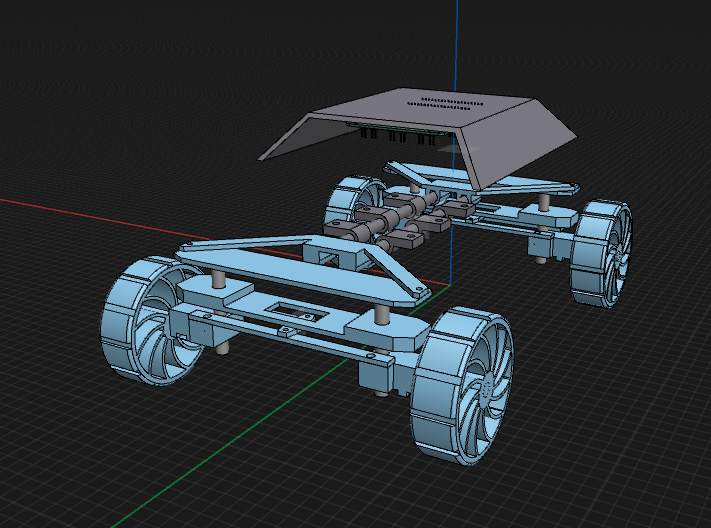

hi

I imported the wheels into the model and did some touch ups to the internals. little clean up stuff.

i also started chasis stuffs but more of it.

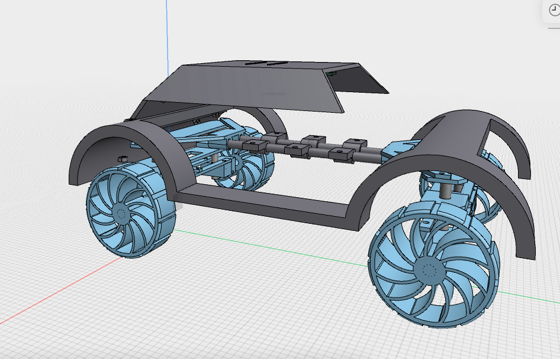

I started making the wheel cover thingy for the car and connected them together to make a frame was pretty simple stuff but then i relise. i need wire management

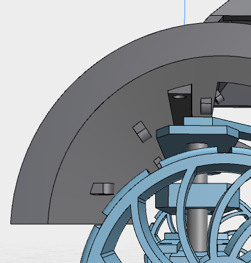

So i made these little hook circle thingies. they dont hold wires by themselves. instead they were made to hold zip ties and you zip tie the wires to them.

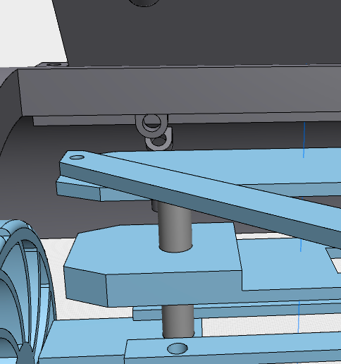

Better image^\
making these i just made one of them in a differnt place, moved it where i wanted it and then started copy pasting them where i wanted. pretty relaxing after the pain of doing chsis stuff.(it was easy but painful).

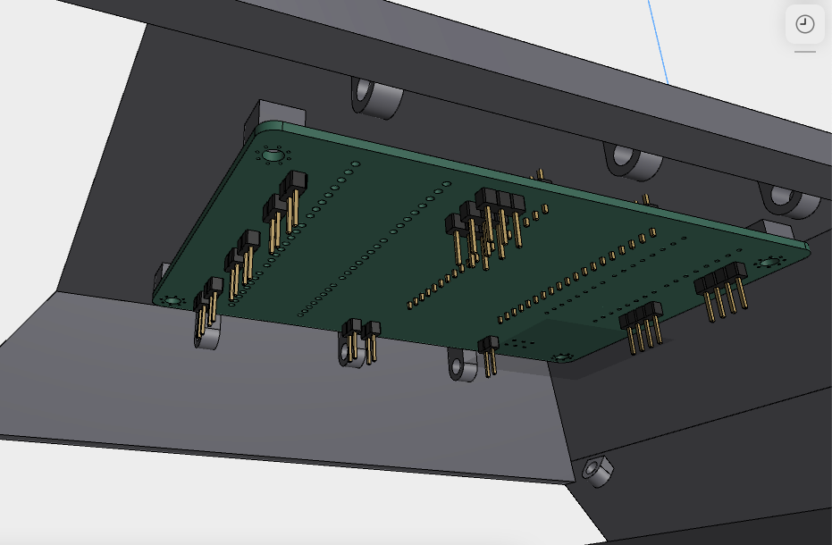

The holes go all the way to the mainboard to wherenver they connect. pretty nice system if you ask me.

Time spent: 4 hr

## 7th July

hihi

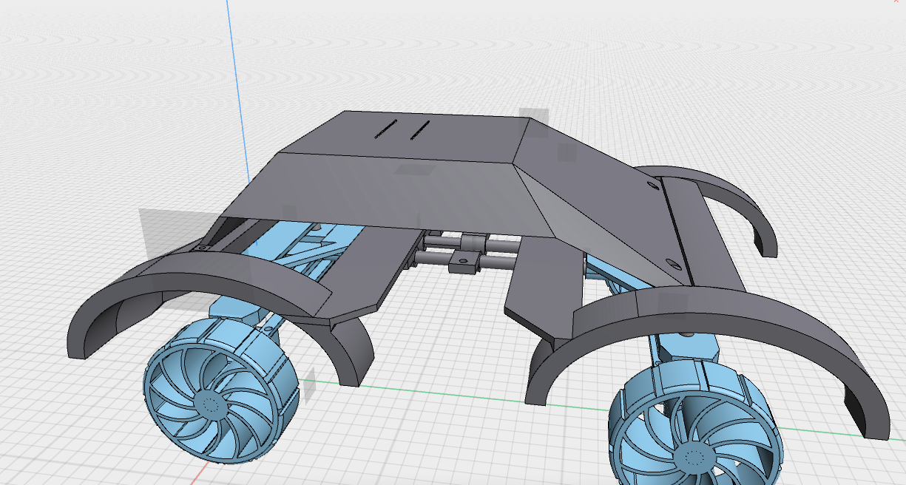

So i kinda messed up o the chasis design on lots of different areas so gonna talk about it here.\
So this is what the main chasis will look like. or at least this is the start of it.\
i did this design because I was just trying to make something car shaped and landed on this.\
anyways time to explain each part in depth.

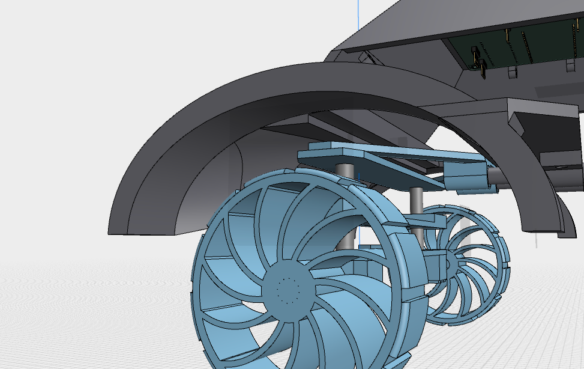

this is the tires cover/mudflap/idk im not a car person

either way its cool. I chose an oval because this thing needs to turn and the axis of rotation is fairly far away from the wheel itself which would mean thw it has lots of horizontal movement, therfore needing the extra space on the front and back

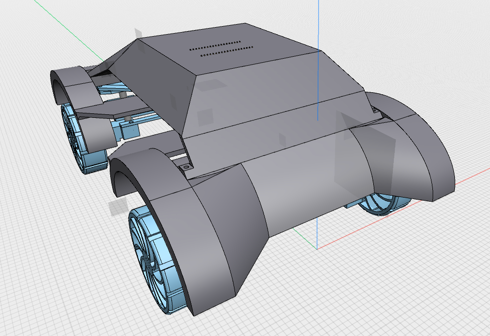

This side actually looks good though\
you have to admit it\
I had lots of fun and pain with the loft and split body tools to make this with heaps of different sketches and shapes. to make this you are basically just making a bunch of planes and sketches and lofting them together. then use split body to remove excess materials

you can probably see way too many screw holes which will be a pain to build.

Also im ditching the arm now too. this thing is already really big and heavy. an arm would make that worse plus power comsumption would be through the roof. and i cant fit a bigger battery.

Time Spent: 5 hours

## 8th  july

nearly done

The top piece of the chasis is too big for my printer so i needed to chop it

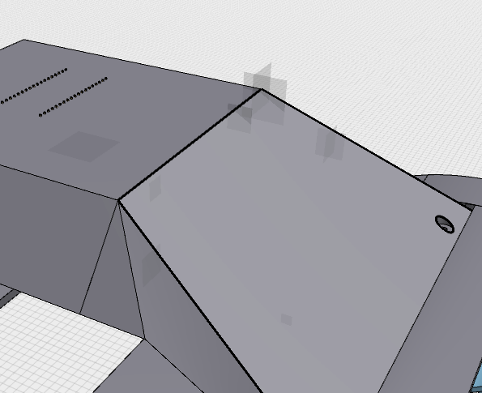

I made vertical cut here to split it into 2 pieces and added holes and a connector piece to seal it together.

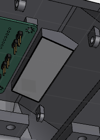

this piece just has 4 screws go into it to connect those 2 pieces.

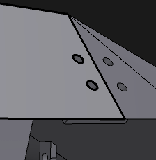

I added the same bracket thing on the sides and  it looked pretty good. now it fots on my printer and works well(maybe)

Time Spent: 4 hours

## 9th july

Time to work on battery mount. Final straw( I think)

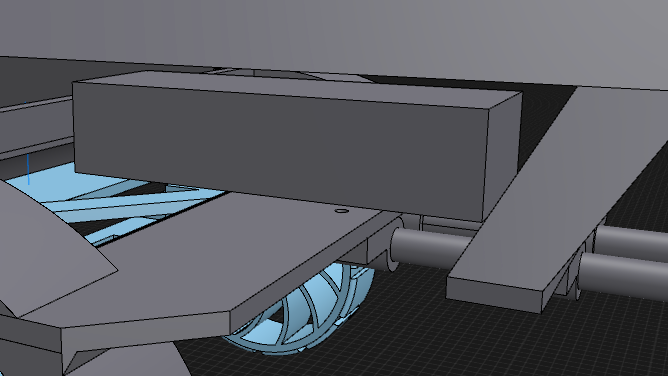

so this is how big the battery is. takes up a decent chunk of size and now i gotta make a braket for it.

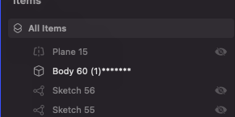

before we start, funny number

I changed the colurs of the cad to some I think that I would like so the following may be a bit hard to see.

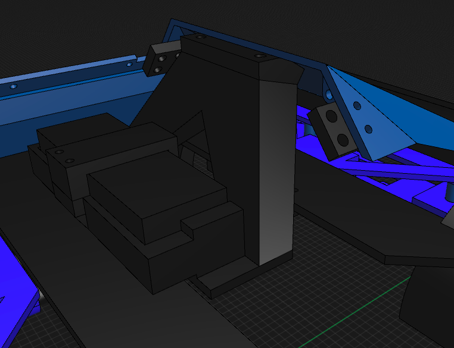

Here is what the completed bracket looks like.

I basically just made a box around the battery and made a J that goes over the battery and uses screws to hold itself in. You can also see the connector piece from earlier. I multitasked it to also act as a support beam for the front and to connect the chasis to the frame. pretty cool.

Time Spent: 6 hours

## 19th of July

Okay I need to speedrun this project if I want it out on time to get my stipends.

so controller time. I speedrun this so fast in one day. 

First what i wanted: 2 encoders, 2 triggers, all battery powered.

Here are images of what I made:

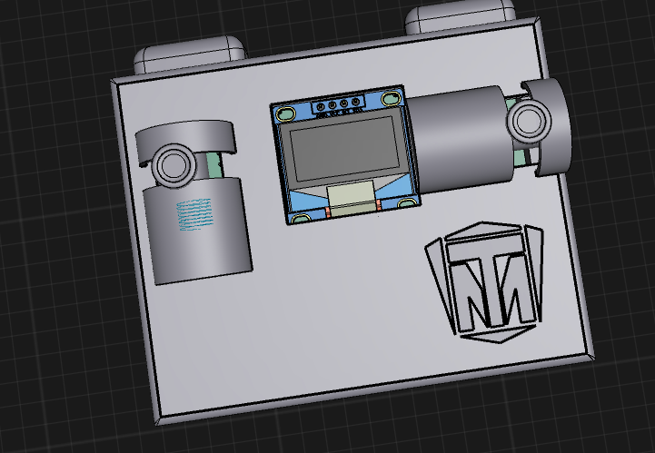

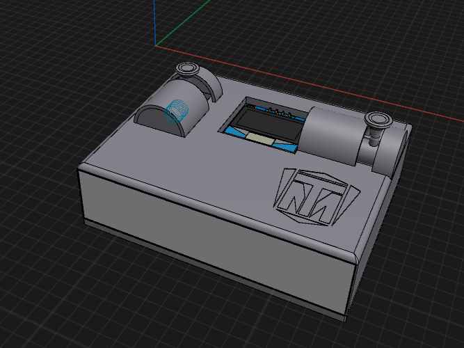

This is the controller. it uses 2 horizontal encoders. (one for acceleration, other for turning.

trigger 1 changes driection, trigger 2 just exists for now until i decide what to do with it.

for the joysticks on the encoders, i used a bunch of drafts to get a general shape and then filleted a bunch to get the curves. the this is that there was no feasable wayt ot get it into the case to begin with so i chopped off the top and gave it a rod so it can be assembled.

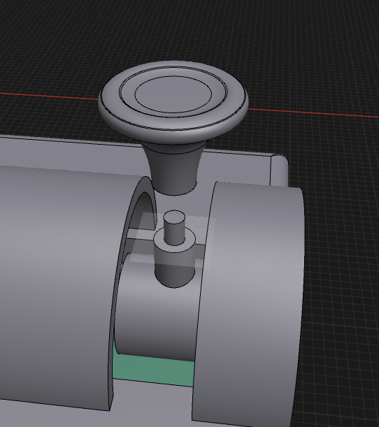

the pcb schematic looks like so:

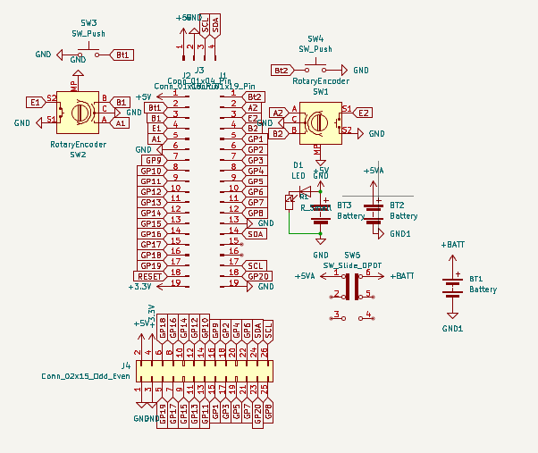

the extra battery stuff is for a boost converter since the esp needs 5V and not 3.7 that normal lipos give.

The LED and resistor is an indicator led to tell when it is on. it would make a low underglow from the case. i can adjust the resistance to make it lower glow if nessasary.

time spent: 8 hours

## 20th of July

Okay time to start submission stuffs
need to make a readme and luckily i made my bom while working of ts

It got rejected :(

## 29th of July

Okay every other project is done. now to speed run changes here

FIRSt i need to downgrade from 4wd to to 2wd, next create a gear down systenm and new turning system that is stronger than the previous one.

then new pcb to accomodate stronger motors

and new firmware

okay so first grinding the model

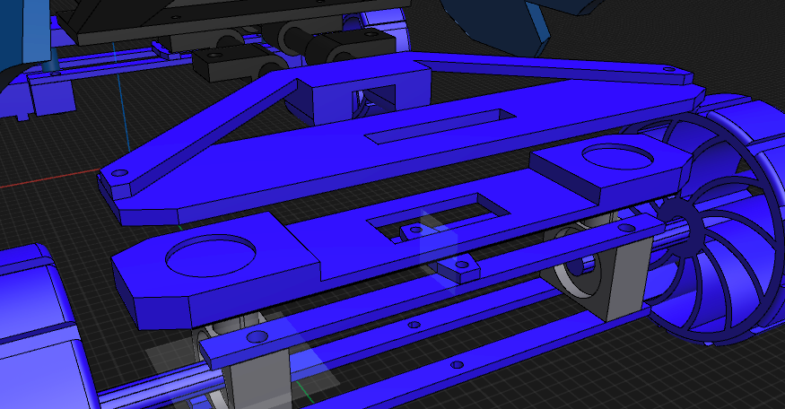

here is what i had before for my turning

i need to change it to 2 separate systems. this will let me do differential turning

It needs to be stronger + needs to be 2 separate servos + more stability

I spent a bit on it and got this thingy up:

Hours spent: 3

## 30th july

okay full sprint time

so made a gear system in onshape and made brackets and whatnot. it will be 16:1 

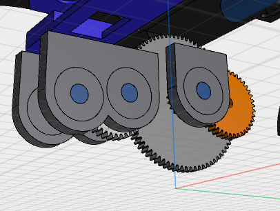

spent like 4 hours on this because of how iffy gears are

I went through liek a bunch of different ratios and combos to see which one would fit the best and landed on this.

so thats nice. imma finish turning system now

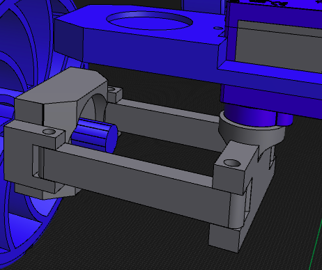

okay thats done. imma use dowels to hold the parts together because its better than screws

okay problem with the gears. 

the motors can't go next to each other without clipping 

I need to extend it out by at least 40mm to make it fit sure one wheel would need to spin a bit slowwr but I can fix that in firmware

it should be fine hopefully.

I spent a while looking at alternatives for the motor but I couldn't really find anything that was strong enough.

time spent: 8 hours

## 31st of July 

wait a minut

I think i put the gears on backwards

imma kms

holy fjdwfgjsaklgfjqsfagf
s

how am i so dumb

okay time to fix this

*one eternity later*

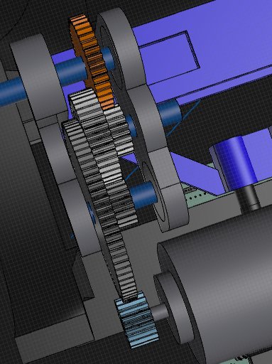

okay so i changed it to be the right way round this time

so now it makes the motor slower instead of faster

okay so because I was given the opportunity to change the gears up a little, I used it to add anti slip to the gear(probably should have done the a while ago) but also make the gears go outwards a bit instead of staying in a line. so now I can get my 2 motors to fit together on a single line. 

okay tbh I did the extending thing first and then I had the vision to do it like that and it worked so me happy.

Next I need to do the PCB. I need to use the BTS7960 motor driver. because tb6612 doesn't have enough current for the 775s(new stronger motor)

this thing is mounted separately off the PCB. and has 8 wires that connect to the microcontroller 

each one controlls one motor so I need 2 of these. 

so I put 2 2x4 headers on my PCB and connected it based on the AliExpress product description.

this made my PCB shorter. which was nice.

also amongus
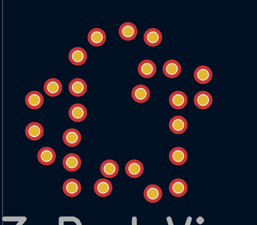

okay now I need to update my model based on the new PCB and to handle new drivers that need to be mounted.

I spent like an hour doing different ways to position the 3 PCBs to mount it( mainly waiting cuz my laptop is getting Hella slow and the file is getting really big atp.

I eventually got it

it's really really tight though.

so after that I sent the model in for a sanity check in #highway and they pointed out a few things. my motor mount wasn't connected to anything, and the turning main rod looked weak.

so I fixed the mount problem and slept

Time spent: 12 hours :sob:

## 1st August 

time to grind in school 

fixed the turning issue thingy being weak in about an hour

then started doing final touches and taking screenshots /renders of everything for the readme

after that I did a small amount of BOM stuff but my 3rd class didn't have much room to do stuff

I spent about 3 and a half hours at school working

and then got the BOM and readme done

I went to the library and spent like 20 mins doing firmware and finished BOM

time spent:4 hours

