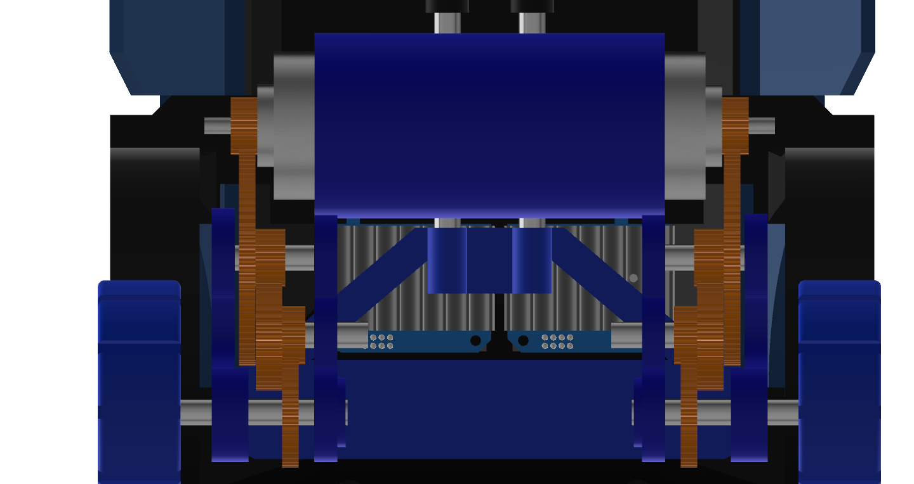

# Insert project name here

## 15th of May

highway was just announced :D

Anyways I was coming up with a few project ideas when suddenly I thought: GUN\
But a gun is boring tbh. It just shoots and does weird stuff.\
So what could be better than a gun you may ask?\
A gun.... ON WHEELS.\
But what could be better than a gun on wheels?\
A REMOTE CONTROL GUN ON WHEELS.

You heard it here first folks. thats how we roll.

Anyways now its time for my suoer cool progress report\
*insert super cool name for the project report*\
I did some cadding today for like an hour or 2 and I made a wheel :D\
I also made some gears and mechanical stuff for the back tires.\
thats about it tbh.\
\

Anyways time for a farewell my good friends, \
Until the next we meet.

Time spent: about an hour

## 16th of May

hello. I am writing this on the 17th cuz i forgot to do it yesterday.\
anyways I dibbled a bit in the cad but mainly started up with my pcb and electronics.

so I started doing pcb stuff. but I came across a problem.\
I dont want to buy and use a motor driver. but I need the dc motor to be able to move forwards and backwards.\
after a bit of thinking, i remembered an old school project where i did that but with a physical switch.\
now the question was, how do i make that into something i can turn on with gpio pins?

after a bunch of thinking and designs later, I reinvented the H bridge.\

after that i started work on the schematic and pcb and ended off the day looking like this:\
\

oh yeah i decided to use an esp32 as the mcu so i could use esp-now as the communication between it and the controller.

Time spend: 1-2 hours(I forgot but somewhere in that range)

## 17th of May

okay time for todays update. im gonna talk as if you have image references and then add the images in later cuz im not bothered rn tbh.\
if you can see images here then congrats, you came after i added images.

Okay so with my schematic i added a whole bunch of stuff like the stepper motor, more h-bridges, more servos, battery connectors, etc.\
also that weird stuff going on with my battery connectors is me trying to make both a 6V and 12V power supply come from 2 6V batteries.\
so the diodes limit the flow so it doesnt blow up on itself and the batteries are aranged so they are both in series and in parallel at the same time.

I also added more h-bridges and servo spots than im actually gonna use\
the thought process is that if in the future i wanted to change up the functionality, then i could use those extra ones if needed. plus I had space anyways.

\

tmrw im gonna probably gonna go and start on the internals cadding. but i need to do meth and physics hw first :(\
anyways bye

Time spent today: 5 hours

## 18th of May
### 1am
so i was looking into the esp input voltage and turn out it can handle a 12V input.\
but that diode mess was not for nothing. I still need it for my motors.\

UPDATE: im just gonna use a buck converter. I dont wanna gamble on my idea just to save $2

found a nice battery so gonna save the link here: https://www.amazon.com.au/cart/smart-wagon?newItems=af51fb0b-661d-4de9-b8e5-c46f956c932f,1&ref_=sw_refresh

Hours spent: 1

## 21st of May
I'm finally back

anyways I am in pain\
onshape sucks\
and linux literally doesnt have any better options.\
so until i get a new laptop, its gonna be incredibly slow production.

anyways what i did today:\
lots of cadding and stuff.\
made some ideas for suspensions\
got a lesson from my dad on how suspensions are stupidly harder to use\
settled on just hard connections\
now designing that stuff\
learnt how horrid onshape is for doing anything big of with lots of parts.

hours spent: 3

## 23rd of May

okay so i got sick yesterday and wasnt able to make an entry so im gonna summarise both days work today. 

So first some yap. In approximately 11 hours and 35 minutes, the kickoff call will start. thats fun and exciting.

Okay so onwards to what I did.\
Yesterday I worked a lot on my back half of the car and did quite a lot of work and got most of the interals done for the back half of the car. And today I finished up those internals and got them at an acceptable standard for me.

\

I also got started on the gun mechanism and roughly mapped out 2 of the axis for my gun to move around with.

\

# THE PROBLEM

So due to australian gun laws, it is illegal to possess, make, or hold schematics of any weapon. Toy or not.\
Due to this, my entire plan of making a gun on top of an rc car is shut down.\
So what can i do to solve this?\
Its an rc car with a 4 axis robotic arm on top.\
Instead of a ranged weapon, its a close combat fighter. /j

anyways thats my idea now so I need to go back and make changes to my pcb and bom. I need to add another stepper motor to my pcb(this is gonna take a big battery)\
My plan for the arm is to have 3 bending points and one spinning point. the bottom bending point uses a stepper motor for extra strength and the top 2 and hand will use servos the hand might use a 5v motor though. (havent decided yet)
