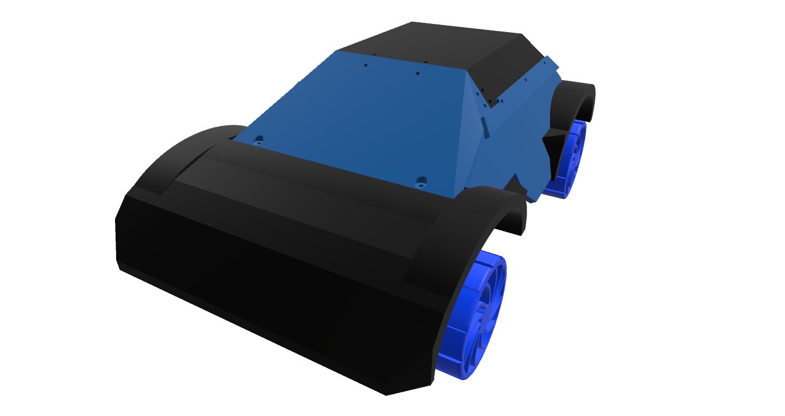
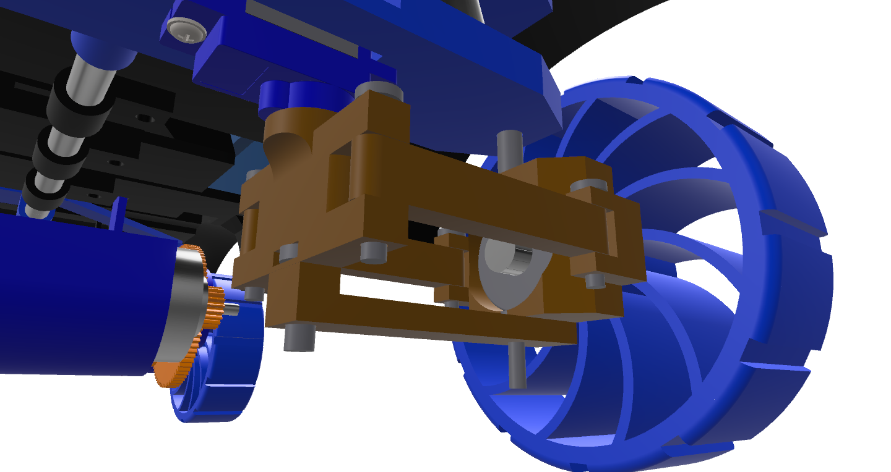
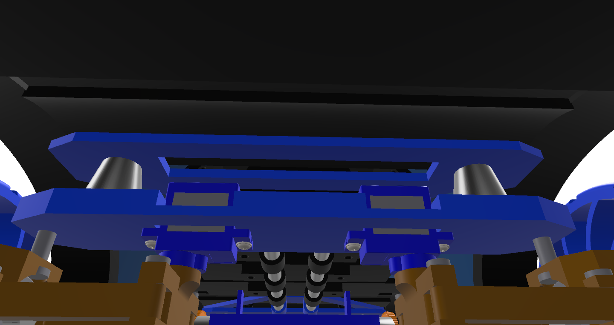
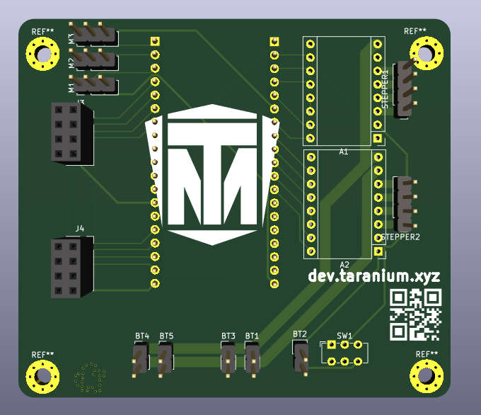
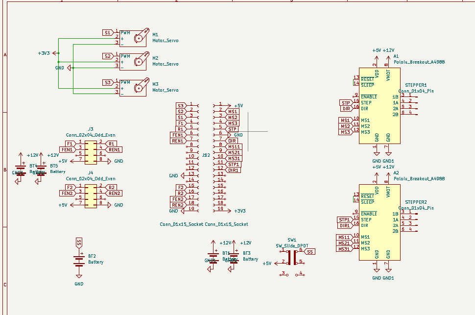
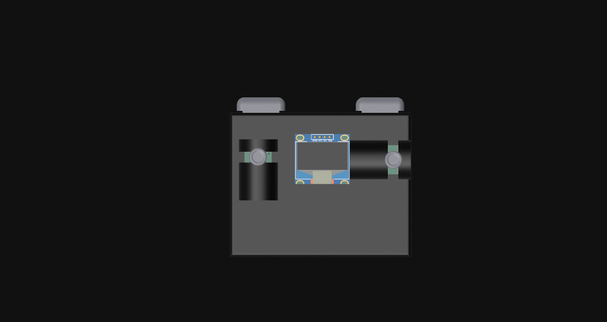
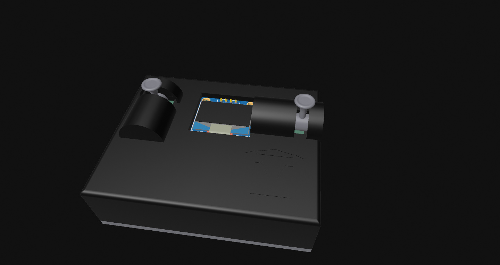
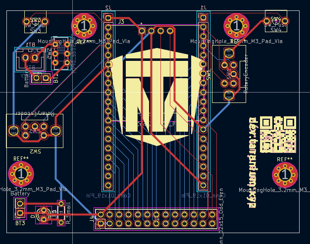
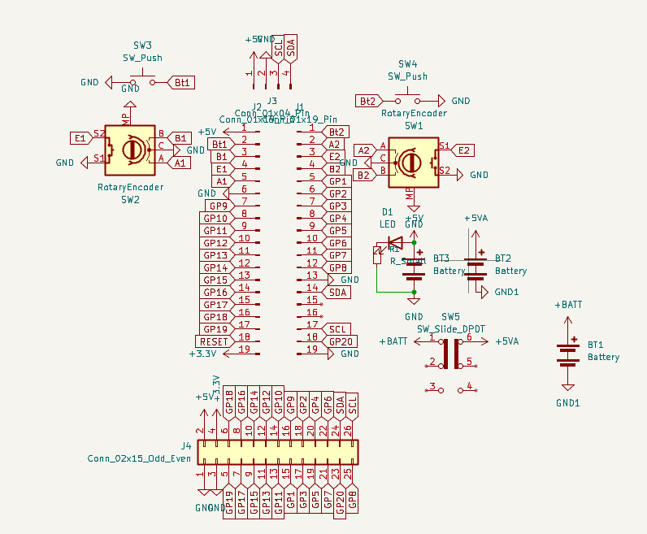

# Taranium Rover
Made By Overlord Runt // Taran The Idiot

## Taranium Rover
This is an RC car I made for Hack Club's [Highway](https://highway.hackclub.com). It has a 4WD system and can turn with all 4 wheels. It uses ESP32 and ESPNow to communicate between the car and the controller

## The Car

### CAD
Majority of this project was getting the cadding of all the different parts done. This isnt what normal custom RC Cars look like and thats because everyone uses the exact same optimal design but I want to make and design something myself. idrc about the "optimal way" cuz where is the fun in that.

This thing is really big so you need like a lot of plates if you want to build it. Roughly about 6 plates and 40 hours of non stop printing.

It uses a crap ton of M3 screws and heatsets, so make sure you stock up on those

### Engineering
So bunch of enginnering went into this design. First the turning system. the 2 front wheels turn separately to allow for differential steering and reduced drag. It also allows me to use weaker and smaller 9g servos that are able to turn one wheel, but not 2.\
It used steel dowels to hold the pieces together and to ensure minimal friction between parts(make it turn stronger)

The bottom piece is there for stability and to make sure the wheel mount doesnt collapse.\
The suspensions are a bunch of high strendth springs that help distribute the weight of the whole car evenly through the wheels and absorb large bumps.\
\

The gear system uses a 16:1 gear down from the 12 000 rpm motor to give a 750 rpm spin under no load with roughly 6-10 Kgcm torque. under load it will have about 4-500 rpm and go about 1m/s. I use a large amount of bearings and steel rods in this design. For assembly, use a grinder to chop the steel rods into all the different lengths needed. You can refer to Full-Build.step in the CAD folder to see how everything is put together.

### PCB

The PCB didnt really take too long but I did have to make many different revisions to get here that did end up taking a lot of time.\
I wanted this to be somewhat of a universal mainboard that could be used in multiple use cases. Which is why I included space for stepper motor drivers. specifically the A4988. as well as 3 places for servos

The PCB features 2 BTS7960 motor drivers. They have 8 pins that connect to the boards(mounted externally). The mainboard also has space to use A4988 stepper motor drivers if you wish to swap out the 775s for stepper motors. 

I didnt have a footprint for the esp32 board that I am using so I just used 2 header pins and separated them the distance that it said on the datasheet.

## The Controller

### CAD
The controller was fairly easy to cad. it uses M3 screws to hold itself together.

The triggers are just extensions to the buttons with a small indent to act as a stabiliser

The joysticks/encoder rods are cool in that I didn't use the revolve tool to make them. just a bunch of extrusions, drafts, and fillets.

Then in order to make it actually buildable, i chopped off the end and added a dowel

### PCB
For the pcb I wanted to keep it basic. So 2 encoders. One for speed, other for turning. then 2 buttons. one to reverse, other for anything else you might wanna add in the future.\
\
Its a cool design if you ask me and it does its job.\

## Firmware

Still need to make it but it will use ESPNow to communicate and just basically use the controller to move the motors. not too difficult.

## How To Build

1. Print out all parts
2. Insert heatsets into all parts
3. Solder circuit boards as shown in schematics
4. assemble internal structures such as the turning system
5. Slide connectors onto rods then use rods to connect 2 internals sides
6. Attach chasis frames beginning with the parts that connect to the frame.
7. Flash esp with code
8. mount pcb of top panel
9. insert battery and sercure it down with screws
10. screw on top panels
11. flash controller with code
12. solder pcb
13. attach first part of the sticks to encoders
14. mount pcb to case
15. attach second part of sticks to encoders and use super glue or hot glue to hold it down
16. screw back panel
17. play enjoy.

If i forgot something I will add it on when I build

## BOM

|Name|QTY|Cost(AUD)|Cost(USD)|Link|
|3s 2.2AH LiPo|1|$47.19||https://www.amazon.com.au/gp/product/B09NXM2DW4/ref=sw_img_1?smid=A3S3YJCXW342CA&psc=1|
|ESP32 Dev Board|2|$7.39||https://www.aliexpress.com/item/1005008499671222.html?spm=a2g0o.cart.0.0.440338dajzfCE9&mp=1&pdp_npi=5%40dis%21AUD%21AUD%207.95%21AUD%207.39%21%21AUD%207.25%21%21%21%402103273e17519916653746516e9cc4%2112000045428891808%21ct%21AU%216138339337%21%211%210|
|Buck Converter|1|$1.47||https://www.aliexpress.com/item/1005006365697021.html?spm=a2g0o.cart.0.0.7b7238daocpVDw&mp=1&pdp_npi=5%40dis%21AUD%21AUD%201.52%21AUD%201.47%21%21AUD%201.47%21%21%21%402101c80017519920616365587e7ede%2112000036911557265%21ct%21AU%216138339337%21%211%210|
|Steel Rods|1|$13.59||https://www.aliexpress.com/item/1005005041338002.html?spm=a2g0o.cart.0.0.7b7238daocpVDw&mp=1&pdp_npi=5%40dis%21AUD%21AUD%2013.59%21AUD%2013.59%21%21AUD%2013.59%21%21%21%402101c80017519920616365587e7ede%2112000031424484647%21ct%21AU%216138339337%21%211%210|
|775 12V DC Motor|2|$31.40|20.2|https://www.aliexpress.com/item/1005006573459459.html?spm=a2g0o.cart.0.0.7c6438da8p7SyB&mp=1&pdp_npi=5%40dis%21AUD%21AUD%2015.69%21AUD%2015.69%21%21AUD%2015.69%21%21%21%402103244417540105652123591ed7b3%2112000037708674071%21ct%21AU%216138339337%21%212%210|
|BTS7960 Motor Driver|2|$15.00|9.65|https://www.aliexpress.com/item/1005007091280016.html?spm=a2g0o.cart.0.0.7c6438da8p7SyB&mp=1&pdp_npi=5%40dis%21AUD%21AUD%207.49%21AUD%207.49%21%21AUD%207.49%21%21%21%402103244417540105652123591ed7b3%2112000039368243485%21ct%21AU%216138339337%21%212%210|
|Header Pins|1|$2.54||https://www.aliexpress.com/item/1005006034877497.html?spm=a2g0o.productlist.main.10.11f92012N9AGjn&algo_pvid=01056414-a579-4c66-8c0f-8c11b43bcf9c&algo_exp_id=01056414-a579-4c66-8c0f-8c11b43bcf9c-9&pdp_ext_f=%7B%22order%22%3A%221565%22%2C%22eval%22%3A%221%22%7D&pdp_npi=4%40dis%21AUD%212.53%212.53%21%21%2111.63%2111.63%21%402103273e17519925834072774e9c9c%2112000035419985198%21sea%21AU%216138339337%21X&curPageLogUid=1HjffVUnlIhg&utparam-url=scene%3Asearch%7Cquery_from%3A|
|Servo Motor 5V|2|$4.69||https://www.aliexpress.com/item/1005006572297006.html?spm=a2g0o.productlist.main.7.66d4e9c1BLk6SW&algo_pvid=e72cc098-c504-4e33-aae5-d6b7896ada10&algo_exp_id=e72cc098-c504-4e33-aae5-d6b7896ada10-6&pdp_ext_f=%7B%22order%22%3A%224516%22%2C%22eval%22%3A%221%22%7D&pdp_npi=4%40dis%21AUD%214.69%214.69%21%21%213.01%213.01%21%402101c5bf17519927191303065e98d7%2112000037705759120%21sea%21AU%216138339337%21X&curPageLogUid=bn0XkIYGxz4A&utparam-url=scene%3Asearch%7Cquery_from%3A|
|M3x10mm Screws||$2.82||https://www.aliexpress.com/item/32810852732.html?spm=a2g0o.order_list.order_list_main.28.74441802cg1DM1|
|M3x16mm Screws||$3.43||https://www.aliexpress.com/item/32810852732.html?spm=a2g0o.order_list.order_list_main.28.74441802cg1DM1|
|M3x6mm Screws||$2.29||https://www.aliexpress.com/item/32810852732.html?spm=a2g0o.order_list.order_list_main.28.74441802cg1DM1|
|M3D5L6 Heatsets|73|$3.82||https://www.aliexpress.com/item/1005003582355741.html?spm=a2g0o.order_list.order_list_main.45.21221802z3BMxP|
|M3 Steel Dowels 20mm|4|$2.47||https://www.aliexpress.com/item/1005003990055624.html?spm=a2g0o.cart.0.0.7c6438da8p7SyB&mp=1&pdp_npi=5%40dis%21AUD%21AUD%202.55%21AUD%202.55%21%21AUD%202.55%21%21%21%402103201917539747613531159ef006%2112000027659580374%21ct%21AU%216138339337%21%211%210|
|M3 Steel Dowels 12mm|2|$2.41||https://www.aliexpress.com/item/1005003990055624.html?spm=a2g0o.cart.0.0.7c6438da8p7SyB&mp=1&pdp_npi=5%40dis%21AUD%21AUD%202.55%21AUD%202.55%21%21AUD%202.55%21%21%21%402103201917539747613531159ef006%2112000027659580374%21ct%21AU%216138339337%21%211%210|
|M4 Steel Dowels 12mm|2|$2.47||https://www.aliexpress.com/item/1005003990055624.html?spm=a2g0o.cart.0.0.7c6438da8p7SyB&mp=1&pdp_npi=5%40dis%21AUD%21AUD%202.55%21AUD%202.55%21%21AUD%202.55%21%21%21%402103201917539747613531159ef006%2112000027659580374%21ct%21AU%216138339337%21%211%210|
|M5 Steel Dowels 25mm|2|$3.16||https://www.aliexpress.com/item/1005003990055624.html?spm=a2g0o.cart.0.0.7c6438da8p7SyB&mp=1&pdp_npi=5%40dis%21AUD%21AUD%202.55%21AUD%202.55%21%21AUD%202.55%21%21%21%402103201917539747613531159ef006%2112000027659580374%21ct%21AU%216138339337%21%211%210|
|Car Mainboard|1|9.18|$6.90|JLCPCB|
|Controller Board|1|15.1|$9.87|JLCPCB|
|3d Printed parts||||I aint counting how many there are|
|LiPo Balance Charger|1|$23.95||https://www.amazon.com.au/Jinming-Battery-Balance-Charger-Blaster/dp/B07JDG4D8W/ref=sr_1_7?crid=2QSVU4PIMQWEP&dib=eyJ2IjoiMSJ9.egVEYVMdFeiJ7Rp5U0GsW3MPCFjH2JppaEegY-6QF1ybXfPnuH7ehcqwsalxISOPBUoZ68yW8V0V9EmSkjSAxz8C7UdrdUezt6iJ5_6-ePqY1OympOLNnzXOyxJhWJ2sCB3tMHHNAahfemRGOHYjULgd62YWGpVJWYwXsBrbpyq5Tr_IyYgdJclzJoRmBvqXEjzY5W0FZaIy_gxmmjxeAksaYQ1llEEbxFEoMpw1EkxXsO2L39F73PxA1ek0gpCMQTNUQ-N5_VKgioZNR_3n90hGdIGBqGgcM8sjdCRed0g.5tzFgGdyR7y_fjpOhZMOOhIfYhpp-g9E6b3zGECYRn8&dib_tag=se&keywords=zeee+3S+lipo+balance+charger&qid=1752048546&sprefix=zeee3s+lipo+balance+charger%2Caps%2C554&sr=8-7|
|Horizontal Rotary Encoder|2|$4.90||https://www.aliexpress.com/item/1005006128388016.html?spm=a2g0o.productlist.main.6.68807HYA7HYAsY&algo_pvid=b1d8a2b1-697b-4cdf-a5ac-84e7fe9106d6&algo_exp_id=b1d8a2b1-697b-4cdf-a5ac-84e7fe9106d6-5&pdp_ext_f=%7B%22order%22%3A%2261%22%2C%22eval%22%3A%221%22%7D&pdp_npi=4%40dis%21AUD%213.00%213.00%21%21%211.93%211.93%21%40210318e817520645594814154ebb46%2112000035886812807%21sea%21AU%216138339337%21X&curPageLogUid=BApYx7Hqtu0n&utparam-url=scene%3Asearch%7Cquery_from%3A|
|T-plug connector|1|$2.61||https://www.aliexpress.com/item/4001212535096.html?spm=a2g0o.detail.0.0.1a35IjAXIjAXdN&mp=1&pdp_npi=5%40dis%21AUD%21AUD%202.61%21AUD%202.61%21%21AUD%202.61%21%21%21%40210318e817520646010564484ebb6d%2110000015320231372%21ct%21AU%216138339337%21%211%210|
|10 gauge wire|2m|$15.45||https://www.aliexpress.com/item/1005007759043423.html?spm=a2g0o.detail.0.0.7927Shi1Shi1fd&mp=1&pdp_npi=5%40dis%21AUD%21AUD%2028.91%21AUD%2015.42%21%21AUD%2015.42%21%21%21%402103273e17540187523768582eab2f%2112000042200258296%21ct%21AU%216138339337%21%211%210|
|3.7V lipo|1|$14.99||https://www.amazon.com.au/gp/product/B09R7F1VV5/ref=sw_img_1?smid=A12788XRWB37UE&th=1|
|XH 2.54 Male connector|1|$1.79||https://www.aliexpress.com/item/1005007460897865.html?spm=a2g0o.productlist.main.3.64b0209u209ugB&algo_pvid=b5ea3270-3fea-44d1-ac17-8cbea19e97f6&algo_exp_id=b5ea3270-3fea-44d1-ac17-8cbea19e97f6-2&pdp_ext_f=%7B%22order%22%3A%226726%22%2C%22eval%22%3A%221%22%7D&pdp_npi=4%40dis%21AUD%211.79%211.79%21%21%211.15%211.15%21%402101d9ee17520717044885071e1aac%2112000040853255020%21sea%21AU%216138339337%21X&curPageLogUid=cFIm27cGLruP&utparam-url=scene%3Asearch%7Cquery_from%3A|
|6mm switch|2|$2.89||https://www.aliexpress.com/item/1005004971266223.html?spm=a2g0o.cart.0.0.68dc38datwPIHU&mp=1&pdp_npi=5%40dis%21AUD%21AUD%202.89%21AUD%202.89%21%21AUD%202.83%21%21%21%402103277f17520760612977156e2f93%2112000031200483146%21ct%21AU%216138339337%21%211%210&pdp_ext_f=%7B%22cart2PdpParams%22%3A%7B%22pdpBusinessMode%22%3A%22retail%22%7D%7D|
|Hardened Springs|4|||sourced from my dad|
|1kg PLA|1|$20||https://fortisfilaments.com.au/collections/pla-regular/products/pla-pro-dark-blue|
|1kg PETG|1|$20||https://fortisfilaments.com.au/collections/petg-1/products/petg-brown|
|Boost Converter|1|$4.83||https://www.aliexpress.com/item/1005008447199869.html?spm=a2g0o.cart.0.0.440338daUp0LxT&mp=1&pdp_npi=5%40dis%21AUD%21AUD%205.10%21AUD%204.83%21%21AUD%204.83%21%21%21%402101e9ec17530288048031105ed1c8%2112000045180678408%21ct%21AU%216138339337%21%211%210|
|SSD1306 128x64 OLED Display|1|$4.20||https://www.aliexpress.com/item/1005009243034318.html?spm=a2g0o.cart.0.0.440338daUp0LxT&mp=1&pdp_npi=5%40dis%21AUD%21AUD%209.33%21AUD%204.20%21%21AUD%204.20%21%21%21%402101e9ec17530288048031105ed1c8%2112000048446306499%21ct%21AU%216138339337%21%211%210|
|TOTAL||$286.03|$184.03||

